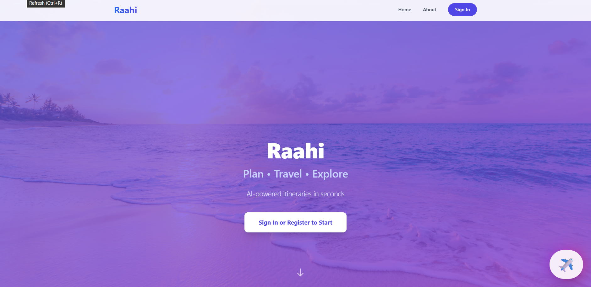
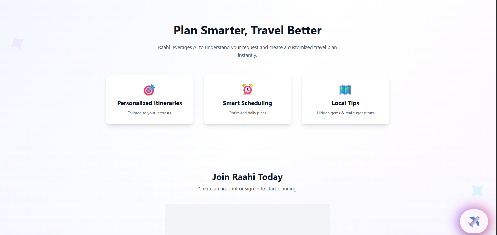
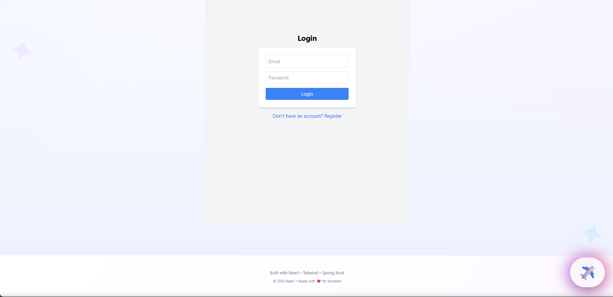
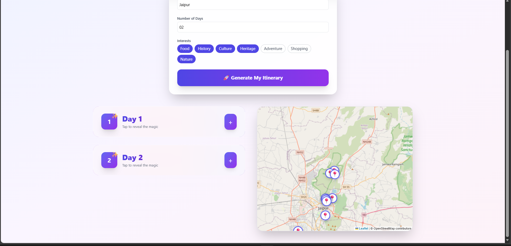

<h1 align="center">🌍 Raahi-Your AI Tour Planner</h1>
<p align="center"><b>Plan • Travel • Explore</b> – AI-powered smart travel planner (React + Spring Boot)</p>


---

## 📌 Table of Contents
- [About](#-about)
- [Features](#-features)
- [Tech Stack](#-tech-stack)
- [Repository Structure](#-repository-structure)
- [Screenshots](#-screenshots)
- [Installation](#-installation)
- [Usage (Quick Start)](#-usage-quick-start)
- [Environment Variables](#-environment-variables)
- [Future Scope](#-future-scope)
- [Contributing](#-contributing)
- [License](#-license)

---

## 📖 About
**Raahi** is a full-stack travel planning application that generates personalized, AI-powered itineraries for users.
It uses a **Spring Boot backend + AI model** to analyze the user’s destination, trip duration, and interests, and then creates a smart, day-wise itinerary.

Each itinerary includes:

Location details with latitude–longitude mapping

Clickable Google Maps directions

Optimized morning, afternoon, and evening plans

Raahi makes trip planning faster, smarter, and fully automated.

---

## ✨ Features
- 🔐 User authentication & secure login  
- 🧠 AI-powered itinerary generation  
- 📍 Destination, number of days & interest selection  
- 📅 Day-wise trip planning  
- 🎨 Beautiful, responsive UI with animations  
- 📡 React frontend connected with Spring Boot backend  
- ⚡ Real-time data handling with REST APIs  

---

## 🛠 Tech Stack
**Frontend:** React, Tailwind CSS, Axios,React Leaflet (OpenStreetMap)
**Backend:** Spring Boot, Java, Spring Security  
**Database:** MySQL  
**Tools:** Postman, Maven, npm, VS Code,Openrouter api

---

## 📁 Repository Structure
raahi/
│
├── backend/                 # Spring Boot backend source code
│   ├── src/
│   ├── pom.xml
│
├── frontend/                # React frontend source code
│   ├── src/
│   ├── package.json
│
├── screenshots/             # Project screenshots used in README
│   ├── home.png
│   ├── dashboard.png
│   ├── about.png
│   └── ...
│   
└── README.md


---

## 📸 Screenshots
  
*Homepage with sections for Home, About & Login*

  
*About page explaining Raahi’s AI-powered trip planning features*

  
*Login/Register page where users authenticate and proceed to their personalized dashboard. *


  
*Dashboard page containing form to take input from user *

  
*Day and time wise itinerary generated along with location pointing on map*

  
*Day and time wise(morning,afternoon,evening) itinerary along with locations on map that directs to google map*

---

## 🛠 Installation

### 📌 Prerequisites
- **Node.js** (v16+)  
- **Java** (JDK 17+)  
- **Maven**  
- **MySQL Server**  

---

### 📥 Clone the repository
```bash
git clone https://github.com/divyanshkande/Raahi.git
cd raahi
```

### ⚡ One-Time Setup for Combined Start

### Create a root-level package.json
```bash
npm init -y
```

### Install concurrently
```bash
npm install concurrently
```

## Edit root package.json and add:
```bash
"scripts": {
  "start": "concurrently \"mvn -f backend/pom.xml spring-boot:run\" \"npm start --prefix frontend\""
}
```

## Install frontend dependencies
```bash
npm install --prefix frontend
```

---

##  🚀 Usage (Quick Start)

From the root folder:
```bash
npm start
```
This will:

Start the backend at: http://localhost:8080

Start the frontend at: http://localhost:3000

---

## 🔐 Environment Variables
Backend (backend/.env)
```bash
DB_USERNAME=your_mysql_username
DB_PASSWORD=your_mysql_password
OPENROUTER_API_KEY=your_openrouter_api_key
DB_URL=your_database_url
OPENROUTER_MODEL_NAME=your_openrouter_model_name
```


## Update your application.properties:
```bash
spring.datasource.username=${DB_USERNAME}
spring.datasource.password=${DB_PASSWORD}
openrouter.api.key=${OPENROUTER_API_KEY}
spring.datasource.url=${DB_URL}
openrouter.model.name=${OPENROUTER_MODEL_NAME}
```

---

### 🔮 Future Scope

- 🌐 **Hotel Rooms Booking System**  
  Allow users to search, book, and manage hotel rooms for their trips.

- 🌓 **Dark Mode Support**  
  Implement a theme toggle for light/dark modes to enhance UX.

- 🤖 **AI-Based Trip Cost Prediction**  
  Integrate machine learning to estimate trip costs based on user preferences and past data.

- 📲 **Progressive Web App (PWA)**  
  Add offline support, caching to minimize API calls, and deployment as a PWA.  
  Optionally, train your own ML model for improved predictions.


---

## 🤝 Contributing
Fork the repository 🍴
Create a feature branch 🌿
Commit your changes ✅
Open a Pull Request 🚀

---

## 📜 License
This project is licensed under the MIT License.
See the [LICENSE](LICENSE) file for more details.

---